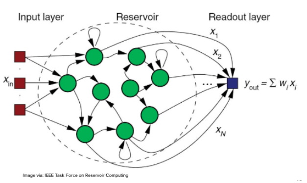

[Home](https://vanfleet0351.github.io/Kyle-Van-Fleet-Portfolio/)

# Nonlinear Drone Controller
  As part of our capstone project at The Ohio State University, we were tasked with creating a non-linear controller to supplement or replace the traditional proportional-integral-derivative (PID) controller of a drone. The goal of this project was to investigate the potential benefit of such a controller over the PID alone. The specific applications under investigation were to see if the non-linear controller would allow a drone to maintain stable flight in the presence of damage, improve maneuverability in confined places, and speed up and automate the tuning process of a drone controller.

### Collaborators:
* [Dimitar Petzev](https://github.com/dpetzev) (petzev.1@osu.edu)
* [Ryan Fisher](https://github.com/rfeesh) (fisher.1587@osu.edu)
* [Mohamed Ahmed](https://github.com/hamadanoor9) (ahmed.682@osu.edu)

### Project Summary:
  This project was performed for the start up company, Rescon, which was founded by Prof. Dan Guathier and Dr. Daniel Canaday. The work was initially based on research in the modeling and control of dynamical systems with reservoir computing performed by Dr. Canaday. Prof. Guathier and Dr. Canaday hypothesized that the reservoir computing could be used as a nonlinear controller for drones. They collaborated with The Ohio State University's capstone project program to have a group of undergaduate computer science students test this hypothesis in simulation software for drones. My team and I were tasked with learning how to write our own [echo state network (ESN)](https://en.wikipedia.org/wiki/Echo_state_network) and integrating it with open source drone controller software and drone simulation software.

#### About the ESN:
  An ESN is a type of [recurrent neural network (RNN)](https://en.wikipedia.org/wiki/Recurrent_neural_network) that uses the [resevoir computing (RC)](https://en.wikipedia.org/wiki/Reservoir_computing) model. The big difference between an ESN and other non-RC networks is that the hidden layer, known as the reservoir, of the network is random and sparsely connected with random uniformly distributed weights. The random edges in the reservoir remove the linear layered structure of the other types of networks we previously talked about. After the creation, it is treated as a black box. There are no recurrent edges to and from the input and output layers, and only the weights of the edges leading to the output layer are adjusted during training.
  

  
  The training phase of the ESN also differs from most common artificial neural networks in that it is further split into two separate periods: the listening (or observation) period and the tuning period. During the listening period, we feed the reservoir with an input signal that we know the desired output for. While this signal is being fed to the reservoir, we record the state of the reservoir for each step-in time. If the input signal is discrete, the time step will naturally be for each bit of discrete input data. If the input signal is continuous, the time should be predetermined. Once the listening period has ended, the weights of the output edges are tuned to minimize the error between the output and the desired output.
  
### Project Outcome:
Because of the COVID-19 pandemic, the semester was cut short for our capstone team, and we were unable to meet all the requirements layed out at the start of the project. However, our team was able to build and test an echo state network and fully integrate it with the controller and simulation software while maintaining stable flight in the simulation. Our team also put together detailed documentation for the company to use as professional development and orientation for new employees and student researchers. This documentation included an introduction to artificial neural networks, recurrent neural networks, reservoir computing, and echo state networks, as well as detailed information on the inner workings of our echo state network, the controller software, and simulation software. 

[Home](https://vanfleet0351.github.io/Kyle-Van-Fleet-Portfolio/)
